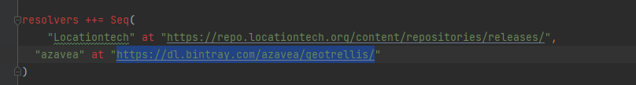
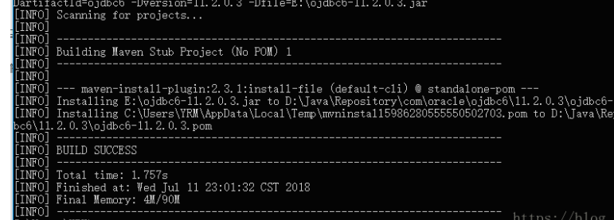

# 错误原因
com.azavea.gdal:gdal-warp-bindings:33.61199eb 无法在中央仓库查找到  

## 解决方法

根据另一个sbt 项目可知：https://dl.bintray.com/azavea/geotrellis/ 在该地址中可查找到。

1. 到网址上下载对应jar包
2. 导入本地仓库
   mvn install:install-file --settings D:\apache-maven-3.6.3\conf\settings.xml  -Dpackaging=jar -DgroupId=com.azavea.gdal -DartifactId=gdal-warp-bindings -Dversion=33.61199eb -Dfile=C:\Users\DELL\Downloads\gdal-warp-bindings-33.61199eb.jar  
   - settings  maven的settings 路径
   - Dfile jar包的所在位置
3. 成功截图
